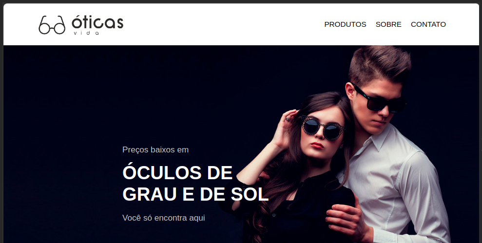

# LOJA DE OCULOS

A proposta desse projeto é criar uma página web para uma loja de óculos em React, para colocar em prática os conceitos adquiridos até aqui:

### Acesse o Link: https://loja-oculos-ruar.vercel.app/

  

## Sobre:

Ao desenvolver a aplicação foi possível aplicar os seguintes conhecimentos obtidos na trilha de React.js:

 - Criar componentes;
 - Importar e exportar componentes;
 - Utilizar componentes nativos do React;
 - Organizar o código da aplicação, dividindo-o em partes menores;
 - Pagina responsividade;

## Demonstração

Apresentação da responsividade em ação:

https://github.com/user-attachments/assets/5bf80cdc-3141-469b-a719-ae8ede48e7dd
